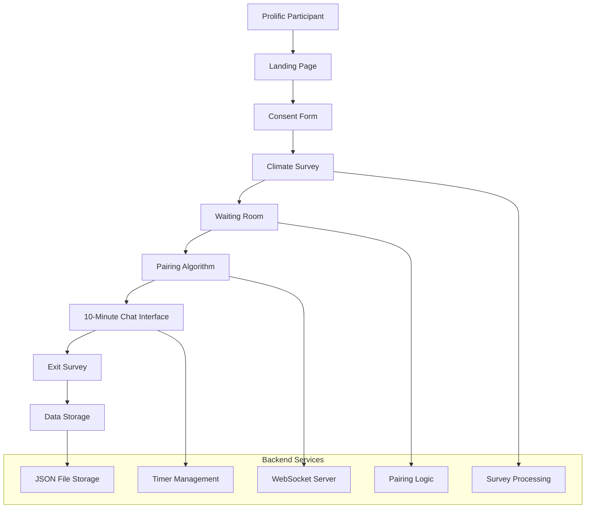

# Climate Change Conversation Platform - System Design Document

## Project Overview

This document outlines the complete system architecture for an experimental web platform that recruits participants from Prolific, assesses their climate change views, and pairs individuals with opposing viewpoints for structured 10-minute text-based conversations.

## Research Objectives

- Facilitate real-time conversations between participants with opposing climate change views
- Collect comprehensive data on participant beliefs and conversation dynamics
- Provide a scalable platform for climate change communication research

## System Architecture



## Core Components

### 1. Frontend Web Application

#### 1.1 Landing Page
- **Purpose**: Welcome participants and provide study overview
- **Content**: 
  - Study title and brief description
  - Estimated time commitment (20-25 minutes total)
  - Prolific ID input field
  - "Begin Study" button
- **Technical**: Static HTML page with form validation

#### 1.2 Informed Consent Form
- **Purpose**: IRB-compliant consent process
- **Content**:
  - Study purpose and procedures
  - Risks and benefits
  - Data usage and privacy
  - Right to withdraw
  - Contact information
- **Technical**: Multi-page form with required checkboxes and signature

#### 1.3 Climate Change Assessment Survey
- **Purpose**: Classify participants as "pro-climate" or "anti-climate"
- **Duration**: 5-7 minutes
- **Question Types**: Mixed format for nuanced position capture

##### Multiple Choice Questions (5-7 questions):
1. **Climate Change Belief Scale** (1-7 Likert)
   - "How convinced are you that climate change is happening?"
   - Scale: 1 (Not at all convinced) to 7 (Extremely convinced)

2. **Human Causation Confidence** (1-7 Likert)
   - "How much do you think human activities contribute to climate change?"
   - Scale: 1 (Not at all) to 7 (Completely)

3. **Urgency Assessment** (1-7 Likert)
   - "How urgent is it to address climate change?"
   - Scale: 1 (Not urgent at all) to 7 (Extremely urgent)

4. **Scientific Trust** (1-7 Likert)
   - "How much do you trust climate scientists?"
   - Scale: 1 (No trust at all) to 7 (Complete trust)

5. **Policy Preferences** (Multiple choice)
   - "Which best describes your preferred approach to climate policy?"
   - Options: Aggressive action, Moderate action, Minimal action, No action needed

6. **Information Sources** (Multiple choice, select all)
   - "Where do you primarily get climate information?"
   - Options: Scientific journals, News media, Social media, Government sources, Personal experience, Other

##### Open-ended Questions (3 questions):
1. **Personal Views** (Text area, 100-300 words)
   - "Please describe your views on climate change in your own words."

2. **Influencing Factors** (Text area, 50-200 words)
   - "What factors or experiences most influence your beliefs about climate change?"

3. **Mind-changing Scenarios** (Text area, 50-200 words)
   - "What, if anything, might change your mind about climate change issues?"

#### 1.4 Waiting Room
- **Purpose**: Queue participants while waiting for pairing
- **Features**:
  - Real-time status updates
  - Estimated wait time
  - Queue position indicator
  - Option to leave study
- **Technical**: WebSocket connection for live updates

#### 1.5 Chat Interface
- **Purpose**: Facilitate 10-minute structured conversations
- **Features**:
  - Messenger-style interface
  - Real-time message delivery
  - Countdown timer (10 minutes)
  - Character limit per message (500 characters)
  - Send button and Enter key support
  - Typing indicators
  - Message timestamps
  - Auto-save functionality
- **Technical**: WebSocket-based real-time messaging

#### 1.6 Exit Survey (Optional)
- **Purpose**: Collect post-conversation feedback
- **Questions**:
  - Conversation quality rating (1-5)
  - Attitude change assessment
  - Technical issues encountered
  - General feedback (open-ended)

### 2. Backend Services

#### 2.1 Survey Processing Engine
- **Classification Algorithm**:
  - Calculate composite score from Likert responses
  - Weight questions based on importance
  - Apply threshold for pro/anti classification
  - Handle edge cases and neutral responses
- **Scoring Formula**:
  ```
  Climate_Score = (Q1 + Q2 + Q3 + Q4) / 4
  Policy_Weight = Q5_mapped_to_scale
  Final_Score = (Climate_Score * 0.7) + (Policy_Weight * 0.3)
  
  Classification:
  - Pro-climate: Final_Score >= 5.0
  - Anti-climate: Final_Score <= 3.0
  - Neutral: 3.0 < Final_Score < 5.0 (excluded from pairing)
  ```

#### 2.2 Pairing Algorithm
- **Matching Logic**:
  - Pair pro-climate with anti-climate participants
  - First-come-first-served within categories
  - Maximum wait time: 10 minutes
  - Fallback: Notify if no match found
- **Queue Management**:
  - Separate queues for each classification
  - Real-time queue status updates
  - Handle disconnections and timeouts

#### 2.3 Timer Management System
- **Conversation Timer**:
  - 10-minute countdown for each conversation
  - 2-minute warning notification
  - 30-second final warning
  - Automatic conversation termination
  - Grace period for final messages (30 seconds)

#### 2.4 WebSocket Server
- **Real-time Features**:
  - Message broadcasting between paired participants
  - Queue status updates
  - Timer synchronization
  - Connection management
  - Reconnection handling

### 3. Data Storage System

#### 3.1 File Structure
```
data/
├── participants/
│   ├── participant_[ID].json
├── sessions/
│   ├── session_[ID].json
├── conversations/
│   ├── conversation_[SESSION_ID].json
└── exports/
    ├── daily_export_[DATE].json
```

#### 3.2 Data Schemas

##### Participant Data
```json
{
  "participant_id": "p_001",
  "prolific_id": "prolific_abc123",
  "timestamp_joined": "2025-05-31T11:20:00Z",
  "classification": "pro_climate",
  "classification_score": 6.2,
  "survey_responses": {
    "multiple_choice": {
      "climate_belief": 7,
      "human_causation": 6,
      "urgency": 7,
      "scientific_trust": 6,
      "policy_preference": "aggressive_action",
      "information_sources": ["scientific_journals", "news_media"]
    },
    "open_ended": {
      "personal_views": "Climate change is the most pressing...",
      "influencing_factors": "Scientific evidence and personal observation...",
      "mind_changing": "Only overwhelming contradictory evidence..."
    }
  },
  "demographics": {
    "age_range": "25-34",
    "education": "bachelor_degree",
    "country": "US"
  }
}
```

##### Session Data
```json
{
  "session_id": "sess_12345",
  "timestamp_start": "2025-05-31T11:25:00Z",
  "timestamp_end": "2025-05-31T11:35:00Z",
  "participants": ["p_001", "p_002"],
  "pairing_time_seconds": 45,
  "conversation_duration_seconds": 600,
  "completion_status": "completed",
  "technical_issues": [],
  "message_count": 47
}
```

##### Conversation Data
```json
{
  "session_id": "sess_12345",
  "conversation": [
    {
      "timestamp": "2025-05-31T11:25:15Z",
      "sender": "p_001",
      "message": "Hi! What are your thoughts on renewable energy?",
      "character_count": 52
    },
    {
      "timestamp": "2025-05-31T11:25:45Z",
      "sender": "p_002", 
      "message": "I think it's too expensive and unreliable...",
      "character_count": 47
    }
  ],
  "conversation_metadata": {
    "total_messages": 47,
    "messages_per_participant": {
      "p_001": 24,
      "p_002": 23
    },
    "average_response_time_seconds": 18.5,
    "longest_message_chars": 487,
    "conversation_topics": ["renewable_energy", "economics", "reliability"]
  }
}
```

## Technical Implementation

### 4.1 Technology Stack
- **Frontend**: HTML5, CSS3, JavaScript (ES6+)
- **Backend**: Node.js with Express.js
- **Real-time Communication**: Socket.io
- **Data Storage**: JSON files (as specified)
- **Deployment**: Local development server or cloud hosting

### 4.2 Key Dependencies
```json
{
  "express": "^4.18.0",
  "socket.io": "^4.7.0",
  "uuid": "^9.0.0",
  "moment": "^2.29.0",
  "cors": "^2.8.5"
}
```

### 4.3 API Endpoints
- `GET /` - Landing page
- `GET /consent` - Consent form
- `GET /survey` - Climate survey
- `POST /survey/submit` - Submit survey responses
- `GET /waiting` - Waiting room
- `GET /chat/:sessionId` - Chat interface
- `POST /exit-survey` - Submit exit survey
- `GET /admin/data` - Data export (admin only)

### 4.4 WebSocket Events
- `join_queue` - Participant enters waiting queue
- `match_found` - Pairing successful
- `match_failed` - No match after timeout
- `message_send` - Send chat message
- `message_receive` - Receive chat message
- `timer_update` - Conversation timer update
- `conversation_end` - 10-minute limit reached
- `participant_disconnect` - Handle disconnections

## Implementation Phases

### Phase 1: Core Survey System (Week 1)
- Landing page and consent form
- Climate change survey implementation
- Basic data collection and storage
- Participant classification algorithm

### Phase 2: Real-time Chat (Week 2)
- WebSocket server setup
- Chat interface development
- Message storage and retrieval
- Timer implementation

### Phase 3: Pairing System (Week 3)
- Waiting room interface
- Pairing algorithm implementation
- Queue management system
- Error handling and edge cases

### Phase 4: Data Management (Week 4)
- Data export functionality
- Analytics and reporting
- Admin dashboard
- Data validation and cleanup

### Phase 5: Testing and Deployment (Week 5)
- User acceptance testing
- Performance optimization
- Security review
- Production deployment

## Ethical and Privacy Considerations

### 5.1 Data Privacy
- Anonymous participant IDs (no personal information stored)
- Secure data transmission (HTTPS/WSS)
- Local data storage (no cloud databases)
- Data retention policy (delete after analysis)

### 5.2 Participant Safety
- Clear informed consent process
- Easy exit options at any stage
- Content moderation capabilities
- Support contact information

### 5.3 Research Ethics
- IRB approval required before deployment
- Participant debriefing after conversations
- Data anonymization for publication
- Transparent data usage policies

## Quality Assurance

### 6.1 Testing Strategy
- Unit tests for classification algorithm
- Integration tests for pairing system
- Load testing for concurrent users
- User experience testing with pilot participants

### 6.2 Monitoring and Analytics
- Real-time system health monitoring
- Conversation completion rates
- Technical error tracking
- User feedback collection

## Deployment Requirements

### 7.1 System Requirements
- Node.js 16+ runtime environment
- 2GB RAM minimum
- 10GB storage for data files
- SSL certificate for HTTPS

### 7.2 Scalability Considerations
- Support for 50+ concurrent participants
- Horizontal scaling capabilities
- Database migration path if needed
- CDN integration for static assets

## Success Metrics

### 8.1 Technical Metrics
- System uptime > 99%
- Average pairing time < 2 minutes
- Message delivery latency < 100ms
- Zero data loss incidents

### 8.2 Research Metrics
- Participant completion rate > 80%
- Successful conversation rate > 90%
- Data quality and completeness
- Participant satisfaction scores

## Future Enhancements

### 9.1 Potential Features
- Video chat capability
- Conversation moderation tools
- Real-time sentiment analysis
- Multi-language support
- Mobile app development

### 9.2 Research Extensions
- Longitudinal follow-up surveys
- Conversation topic analysis
- Personality trait integration
- Cross-cultural comparisons

---

**Document Version**: 1.0  
**Last Updated**: May 31, 2025  
**Author**: Research Platform Design Team  
**Status**: Ready for Implementation